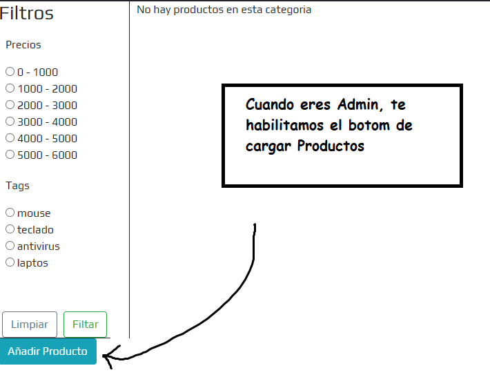

<p align="center"></p>

## Ir Al proyecto
http://darkcode.dhalumnos.com


<h3 align="center">DEVELOPERS</h3> 

### Pasos para instalar el Proyecto

1. Descargar el repositorio, de preferencia en la ruta `C:\xampp\htdocs\`
2. Por consola ingresar a la carpeta del repositorio.
3. Ejecutar `composer install` para que composer descargue todas las carpetas y paquetes necesarios para correr Laravel.
4. Revisar que exista archivo `.env`. Si no está copiar el archivo `.env.example` cambiarle el nombre `.env` y eliminar `.env.example`. Hago una copia de este archivo en drive, también la puedes googlear y copiar
5. Chequear que tenga valores la posicion `APP_KEY`. Si no está hay que crearla con el comando `php artisan key:generate` esto esta en el archivo `.env`
6. Revisar la información de conexión a la db. Son las posiciones `DB_ ` del archivo `.env`.
7. **Tener Creada una base de datos** llamada `darkcode` desde MySQL/PHPMyAdmin **ósea la BD vaciá**
8. Correr las migraciones: `php artisan migrate` esto crea las tablas en la base `darkcode`
9. Crear las carpetas `products` y `profiles` en storage/app/public/
10. [NO USAR] Correr el seeder: `php artisan db:seed` [Paquete abandonado]
11. Ejecutar `php artisan serve` para iniciar el servidor web. La ruta esta en la consola, puedes probar con `http://localhost:8000/`
12. Registrar un usuario y sea con el `registro` o a mano en la BD, cambiarle el rol a (**Admin** | Osea `rol=1`) y comenzar a llenar 5 productos



<h3 align="center">DEPLOY</h3> 

Para este caso usar `darkcode.sql` en el servidor de base de datos

Contiene el usuario administrador

````
admin@gmail.com
123456
````


## Este proyecto fue echo en


<p align="center"></p>


## Se Usaron las siguientes teconologias
<p align="center"></p>
