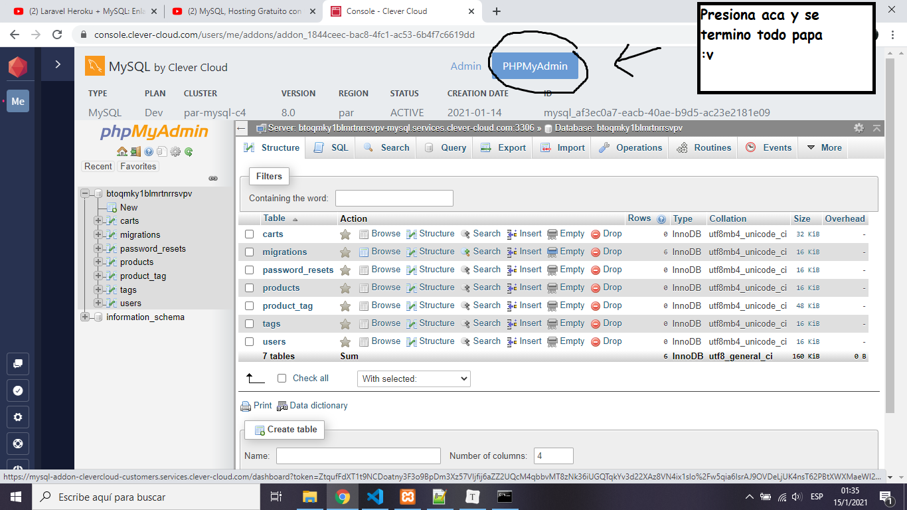

<p align="center"></p>


**eCommerce** de productos tecnológicos

### Ir Al proyecto

https://darkcode-laravel.herokuapp.com/

### Datos

````javascript
// usuario administrador
admin@gmail.com
123456
````


<h3 align="center">DEVELOPERS</h3> 

Por favor usar XAMPP con PHP versión **7.5** aprox dado que de **8.0** varias paquetes no lo soportan. Me paso a la hora de querer actualizar no me corría el proyecto en local, ni actualizando el `json`

### Pasos para instalar el Proyecto

1. Descargar el repositorio, de preferencia en la ruta `C:\xampp\htdocs\`
2. Por consola ingresar a la carpeta del repositorio.
3. Ejecutar `composer install` para que composer descargue todas las carpetas y paquetes necesarios para correr Laravel.
4. Revisar que exista archivo `.env`. Si no está copiar el archivo `.env.example` cambiarle el nombre `.env` y eliminar `.env.example`. Hago una copia de este archivo en drive, también la puedes googlear y copiar
5. Chequear que tenga valores la posicion `APP_KEY`. Si no está hay que crearla con el comando `php artisan key:generate` esto esta en el archivo `.env`
6. Revisar la información de conexión a la db. Son las posiciones `DB_ ` del archivo `.env`.
7. **Tener Creada una base de datos** llamada `darkcode` desde MySQL/PHPMyAdmin **ósea la BD vaciá**
8. Correr las migraciones: `php artisan migrate` esto crea las tablas en la base `darkcode`
9. Crear las carpetas `products` y `profiles` en storage/app/public/
10. **[NO USAR]** Correr el seeder: `php artisan db:seed` **[Paquete abandonado]**
11. Ejecutar `php artisan serve` para iniciar el servidor web. La ruta esta en la consola, puedes probar con `http://localhost:8000/`
12. Registrar un usuario y sea con el `registro` o a mano en la BD, cambiarle el rol a (**Admin** | Osea `rol=1`) y comenzar a llenar 5 productos


<h3 align="center">DEPLOY</h3> 

Para este caso usar `darkcode.sql` en el servidor de base de datos

Contiene el usuario administrador

````
admin@gmail.com
123456
````


### clever-cloud

**Alternativa**, según vi en video tutorial si cambias la data del `.env` con la de la BD nueva de la nube entonces solo necesitas hacer

````
php artisan migrate
````

Para crear todas las tablas, **en la BD de la nube**

Luego para modificar cosas usa este botom papa



Ahora ya te quedas trabajando en la BD online

<h3 align="center">BUGS RESUELTOS</h3> 

Aparecieron errores a la hora de deploy en HEROKU

Con las imágenes, no las mostraba esto se soluciona con un nuevo paquete `Intervention\Image` (googlear) tuve que agregar 2 líneas a `congif/app.php` y cambiar el **controlador de productos**, fijate en el código. Además de tener una carpeta `uploads` en la carpeta `publics` para guardar/acceder a las imágenes, dado que si seguía en `storage` a HEROKU le rompe y no lo muestra

Luego me funciono en el local **OK** , lo subí a HEROKU y cargaba las imágenes, el problema apareció ahora en **Agregar Producto**, me salió una pantalla horrible que decía que no tenia GD o algo así

La sol es la siguiente (además adjunto PDF de stackoverflow)

````json
// En composer.json agregar esa linea
"require": {
		...
        "ext-gd": "*"
},

// Luego por consola
composer update
````

Todo esto me permitió arreglar en su totalidad el proyecto :smile::smile::smile::smile:


#### Este proyecto fue echo en


<p align="center"></p>


#### Se Usaron las siguientes tecnologías
<p align="center"></p>
