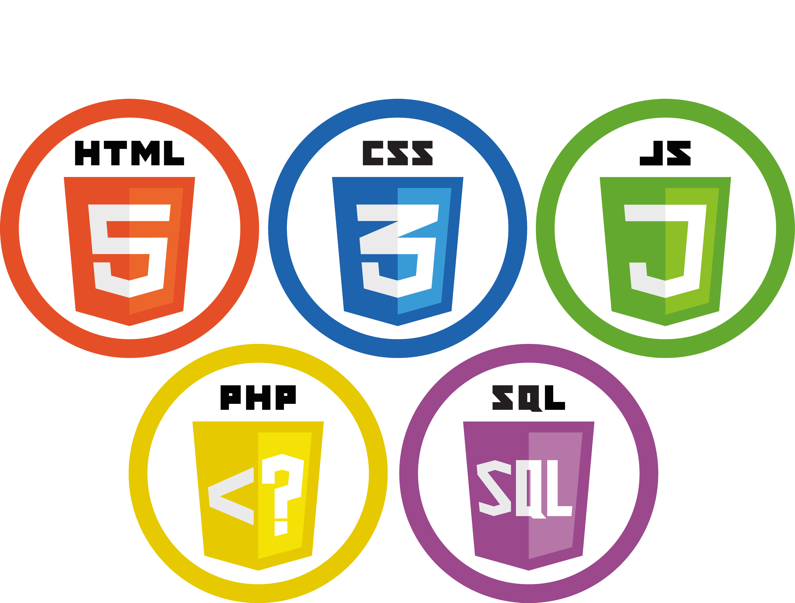

## Ir Al proyecto
http://darkcode.dhalumnos.com

## Pasos para instalar el Proyecto
1. Descargar el repositorio
2. Por consola ingresar a la carpeta del repositorio.
3. Ejecutar `composer install` para que composer descargue todas las carpetas y paquetes necesarios para correr Laravel.
4. Revisar que exista archivo `.env`. Si no está copiar el archivo `.env.example` cambiarle el nombre `.env` y eliminar `.env.example`
5. Chequear que tenga valores la posicion `APP_KEY`. Si no está hay que crearla con el comando `php artisan key:generate`
6. Revisar la información de conexión a la db. Son las posicones `DB_ ` del archivo `.env`.
7. Tener Creada una base de datos llamada `darkcode` desde MySQL.
8. Correr las migraciones: `php artisan migrate`.
9. Crear las carpetas `products` y `profiles` en storage/app/public/
10. Correr el seeder: `php artisan db:seed`.
11. Ejecutar `php artisan serve` para iniciar el servidor web.

## Este proyecto fue echo en

## Se Usaron las siguientes teconologias

